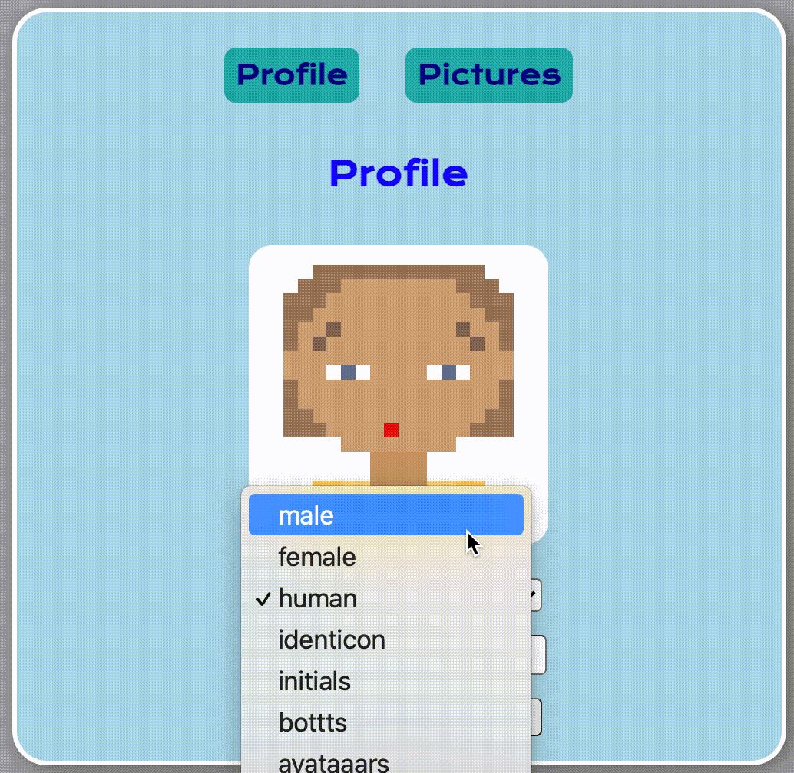
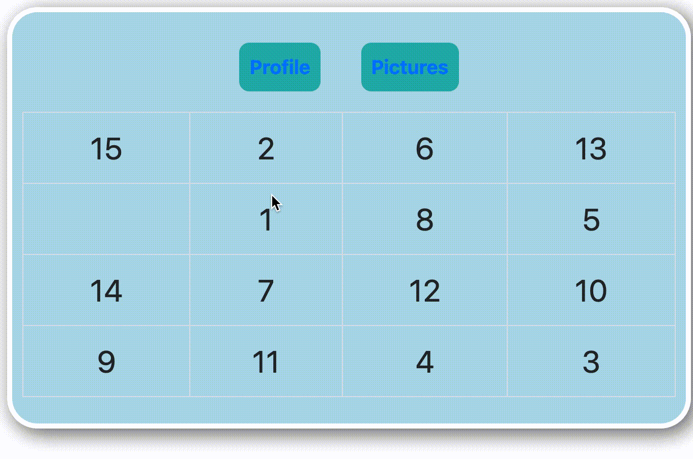
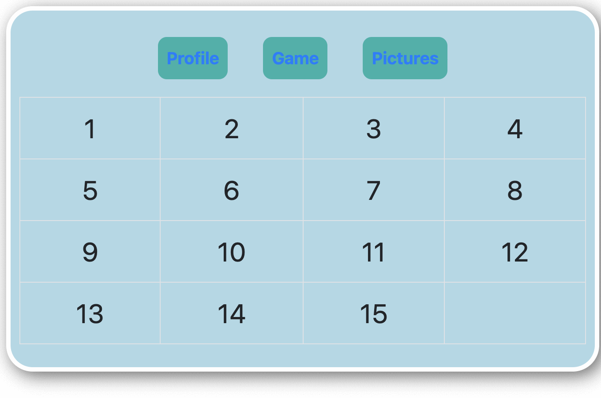

# **Пятнашки на REACT**

***Мы создаём игру Пятнашки с прикольной аватаркой на React!***

Прочитай задание до конца чтобы правильно спроектировать приложение.

_(Совет: делай коммиты только когда приложение работает)_

## Релиз 1:

***Начинаем с навигации***

Создадим компонент, в котором будет находиться меню приложения.

Наше приложение состоит всего из трёх страниц: ***Profile***, ***Game*** и ***Pictures***.

Пока страницы можно оставить пустыми, но меню должно работать.

## Релиз 2:

***Prоfile - создаём интерфейс для аватарки***

На странице _Profile_ создаём интерфейс ввода имени и "расы" пользователя.

Используем для этого API: https://avatars.dicebear.com

## Релиз 3:

***Скрываем ссылку на страницу "Game" пока имя пользователя не введено***  

Пока имя пользователя не введено страница **_Game_** должна быть недоступна.

## Релиз 4:

***Создаём наконец саму игру **_Пятнашки_** см. картинку***

Игровое поле выглядит как таблица 4х4, случайно заполненная цифрами от 1 до 15. Одна ячейка пустая.

Игрок, перемещая в пустую клетку соседнюю "пятнышку" в итоге должен выстроить их все в порядке возрастания.

Процесс игры:

Итог:

## Релиз 5:

  ***Сохраняем игру на бекенде на Redux-Thunk***

  Решение этой головоломки требует времени и нам нужно дать возможность пользователю возвращаться к игре в любой время, для этого сохраняем текущее состояние "пятнашек" на бекенде с использованием библиотеки ***Redux-Thunk***.

  После перезагрузки страницы или при повторном заходе на эту страницу состояние игры и аватарка должны подгружаться с сервера.

  

## Релиз 6:

**_Переключатель визуальной темы на useContext_**

В главное меню нужно включить кнопку-переключатель, при нажатии на которую приложение должно менять цвет фона (светлый/тёмный).

Для реализации этого функционала используем **_useContext_**.

  

## Релиз 7:

**_Картинки на Saga_**

Добавляем страничку **_Saga-Pictures_** в которой показываем случайные картинки, адреса которых получаем с помощью **_Redux-Saga_**.

При переходе на эту страницу или при клике на картинку показываем новую случайную картинку (например кошки или лисички).

Можно, например использовать такие API:

- http://aws.random.cat/meow.

- https://api.thecatapi.com/v1/images/search

- https://randomfox.ca/floof/
